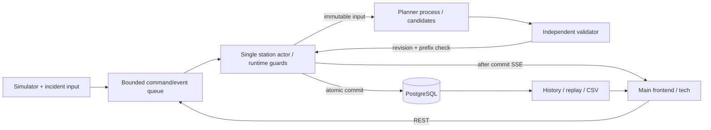

# Техническое задание Цифровая станция

Версия 1.0, 1 октября 2026 года. **Принята пользователем как основа; зафиксирована перед реализацией H0–H2.** Реализация рассчитана на две параллельные дорожки: пользователь с ассистентом делает backend/данные/алгоритмы/интеграцию, друг — основной frontend. При первоначальном исследовании в рабочей папке были только три файла `hackathon_docs/`; существующего кода, API, зависимостей и тестов для переиспользования не обнаружено. Фактическую готовность реализации описывает [отчёт H0–H2](H0_H2_REPORT.md), а не наличие функции в этом ТЗ.

Документ подготовлен **после** сравнительной матрицы и анализа исходников в [RESEARCH.md](RESEARCH.md). Там находятся доказательства, варианты A/B/C и причины решений D1–D10. Здесь — канонические предметные правила, формулы и приёмка. [FRONTEND_HANDOFF.md](FRONTEND_HANDOFF.md) — канонический сетевой контракт, типы и примеры; [PLAN_24H.md](PLAN_24H.md) — бюджет и последовательность. При реализации сначала меняется соответствующее каноническое описание, затем зависимые документы и fixtures. Никакие примеры не являются уже измеренными результатами.

## 1. Результат и границы

Строим учебную плоскую грузовую станцию без сортировочной горки: 4 приёмо-отправочных пути, 4 сортировочных тупика, 2 грузовых пути с платформами/фронтами, вытяжной путь и локомотивная стоянка. Два направления входа/выхода. Сервер исполняет технологические операции, сохраняет состояние и историю, обнаруживает последствия инцидентов и рассчитывает несколько допустимых расписаний с объяснением изменений.

Три независимых ограничения масштаба:

| Уровень | Объём MVP |
|---|---|
| Данные инфраструктуры | 12 функциональных путей, 4 парка, 2 конфликтные горловины, 2 внешние границы, конечный каталог маршрутов |
| Digital twin | Все 12 путей, 7 поездов основного сценария: 6 грузовых с 60 вагонами и 1 пассажирский транзит; тяга/бригады, операции и инциденты. Резервные пути реальны для модели, не декоративны |
| Оптимизация | До 8 известных поездных заданий, до 6 активных поездов внутри станции, до 80 **макроопераций**, горизонт 7200 sim-секунд. Фазы манёвра не считаются отдельными задачами поиска |

Превышение лимита сценария отклоняется при загрузке (`422 SCENARIO_LIMIT_EXCEEDED`); нельзя молча отбросить занятые пути, фоновые составы или ресурсные резервации. Максимум одновременно принятых составов также ограничен четырьмя R; ограничение 6 active является верхним программным пределом, а не обещанием поставить шесть составов на четыре пути.

В обязательный объём входят три разных грузовых процесса, объяснимый алгоритм, независимый validator, автоматически применяемый лучший допустимый вариант и сравнение альтернатив, поток ≥1 Гц, инциденты, история 24 wall-часа, replay последних 15 wall-минут, CSV, роли и настройки, техническая страница и основной UI. P0 означает основу работающего сценария; P1 — остальные обязательные функции, также завершаемые за 24 часа; P2 — расширения вне защищённого бюджета.

Не входят: произвольная реальная станция/редактор схем, горка, полная вагонная сортировка между разными поездами, свободное планирование поездной тяги по сети, реальная сигнализация/управление инфраструктурой, пассажирское обслуживание/посадка/билеты, расчёт тарифов и выручки, обучение моделей/RL/LLM, CV/RFID/датчики, внешние интеграции, 3D, Kubernetes/Kafka/Redis, PDF при рабочем CSV. Пассажирский транзит входит в основное смешанное демо как полноценное ограничение маршрутов/путей. SERVICE/OTHER допускаются схемой, дополнительные профили для них — P2.

## 2. Источники и матрица требований

**O-D** — [официальное DOCX](../hackathon_docs/DOC-20260929-WA0131.docx), полностью прочитаны текст и служебные части с примечаниями. **O-Sn** — физический слайд n [презентации](<../hackathon_docs/Цифровая_станция_презентация 1.10.pptx>), прочитаны все 11 слайдов, заметки и данные диаграммы. Напечатанные номера после четвёртого слайда смещены, поэтому используем физические. **M-n** — фрагмент n [расшифровки](../hackathon_docs/mentor_hackathon_transcript.md), прочитан полностью. **U** — постановка и уточнения пользователя. **A** — наши допущения. Внешние исследования обозначены только в RESEARCH и не превращаются в официальное требование.

Критерии организаторов: UI/UX 30%, планирование и realtime 35%, backend 25%, демонстрация/инженерная культура 10% (O-D «Критерии оценки», O-S10). Поэтому проверяемый вертикальный сценарий, ясный UI и измерение задержек важнее новых интеграций. Сложность не делает официальную функцию необязательной.

Оценки в матрице — добавочный объём B/F в человеко-часах; общие компоненты переиспользуются. Они не заменяют бюджет дорожек PLAN и не суммируются с ним повторно. Проверки A01–A18 раскрыты в §11.

| ID | Требование | Источник | Реализация | Проверка на демо | Приоритет | B / F, ч |
|---|---|---|---|---|---|---|
| R01 | Пути, платформы, стрелки, парки, соединения и занятость | O-D «Задача» 1, O-S4 | Граф 12 путей; грузовые платформы; стрелки в двух конфликтных зонах | A01, A02: схема соответствует фактическим положениям | P0 | 1,5 / 2 |
| R02 | Очерёдность движения, манёвры, назначения путей, локомотивов и бригад | O-D «Задача» 2, O-S4–5 | DAG и выбор допустимых работ/путей/бригад; явная назначенная тяга | A02, A03, A13: ресурсы/зависимости и порядок групп | P0 | 3 / 0,5 |
| R03 | Автоматическое обнаружение конфликтов маршрутов/путей/ресурсов | O-D «Данные», O-S5 | Проверка старого плана при инциденте, отдельный validator, guard перед стартом | A03–A05, A13 | P0 | 1 / 0,5 |
| R04 | Автопересчёт, альтернативы, время и влияние на индекс | O-D «Задача» 5/«Данные», O-S5 | До двух различных проверенных предложений; автоматическое применение лучшего | A03, A06, A10 | P0 | 1 / 1 |
| R05 | Расписание, положения и ресурсы потоком ≥1 Гц; mock допустим | O-D «Данные», O-S5 | Серверный симулятор, SSE снимки + немедленные события | A01, A07, A14 | P0 | 1 / 1 |
| R06 | Буферизация, сглаживание, дедупликация, валидация | O-D «Данные» | Bounded queue, source ID/seq, схемы; фильтр отдельной шумной телеметрии | A08 | P1 | 0,5 / 0 |
| R07 | Reconnect, backoff, «нет связи» | O-D «Данные» | Cursor, catch-up/reset, stale/offline | A07 | P0 | 0,25 / 0,75 |
| R08 | Индекс 0–100, 5 факторов, прозрачные веса/вклад | O-D «Индекс», O-S6 | Формула §8; факт и прогноз отдельно | A09, A18 | P0 | 0,75 / 0,75 |
| R09 | Норма/Внимание/Критично, настраиваемые пороги | O-D «Индекс», O-S6 | Серверные категории и причины | A09, A12 | P1 | 0,25 / 0,25 |
| R10 | Схема, Гант, конфликты, узкие места, рекомендации | O-D «Задача»/«Демо», O-S4/7/9 | Общие ID связывают схему, интервалы и карточку | A03, A18 | P0 | 0 / 3 |
| R11 | Модуль приёма, отдельный planner, шина | O-D «Backend», O-S7 | Модульный FastAPI, asyncio.Queue, отдельный CPU-процесс | A06, A14, архитектурная схема | P0 | 0,5 / 0 |
| R12 | REST/GraphQL для истории/конфига, SSE/WS live | O-D «Backend», O-S7 | REST + SSE, один API обоим клиентам | A07, A11 | P0 | 0,5 / 0,25 |
| R13 | Реляционная история, ориентир 24–72 часа | O-D «Backend», O-S7 | PostgreSQL, retention 24 wall-часа, snapshots/events | A11, A15 | P1 | 1,25 / 0 |
| R14 | Конфигурация индекса/ограничений/planner без сборки | O-D «Backend», O-S6 | DB revisions + scenario JSON; admin PATCH весов/порогов/лимита поиска | A09, A12 | P1 | 0,5 / 0,5 |
| R15 | Логи, метрики, health | O-D «Backend» | Structured logs, health live/ready, JSON metrics | A14, A15 | P1 | 0,5 / 0,25 |
| R16 | Видимое обновление UI <500 мс | O-D «Нефункциональные», O-S8 | Замер ingress→paint с поправкой часов и погрешностью | A14: max, p95, число превышений | P0 | 0,5 / 0,5 |
| R17 | Перепланирование ≤5 с | O-S8; O-D «несколько секунд» | Общий monotonic deadline, поиск ≤3 с | A03, A06, A14 | P0 | 0,5 / 0 |
| R18 | 5–10 одновременных инцидентов без просадки UI | O-D «Нефункциональные», O-S8–9 | Batch 5/10, один запрос поиска, поток продолжает работу | A06, A14 | P0 | 0,5 / 0,25 |
| R19 | Auth и ограничение настроек/оптимизации | O-D «Нефункциональные», O-S8 | Четыре роли, session cookie, проверки backend | A12 | P1 | 0,75 / 0,5 |
| R20 | OpenAPI/Swagger и архитектурная диаграмма | O-D «Нефункциональные», O-S8 | Pydantic/OpenAPI и схема §5 | A16 | P1 | 0,25 / 0 |
| R21 | Перемотка 5–15 мин | O-D «Демо», O-S9 | 15 wall-минут read-only replay с сохранёнными sim-times | A11 | P1 | 0,75 / 0,75 |
| R22 | Мини-отчёт PDF/CSV | O-D «Демо», O-S9 | UTF-8 CSV; выбран разрешённый формат CSV | A11 | P1 | 0,25 / 0,25 |
| R23 | Запуск, Git/README, 10–12 слайдов, видео/live | O-D «Сдача», O-S9/11 | Инструкция, 10 слайдов, репетиция и резервная запись | A16, A18 | P1 | 1 / 1 |
| R24 | Mock по умолчанию, секреты env, без реальных коммерческих данных | O-D «Безопасность», O-S11 | Синтетический fixture, `.env.example`, env passwords/DB URL | A12, A16 | P1 | 0,25 / 0 |
| M01 | Цикл прибытие–отправление, выбор станции, грузовой акцент | M1–4, U | Три профиля и вариант B | A01–A03 | P0 | В R01/R02 |
| M02 | Клиенты, сроки, объёмы, экономический компромисс | M3–4 | destination/due/priority и вагонное ожидание; без вымышленной денежной выгоды | A09, A18 | P1 | В R08 |
| M03 | Общая система, роли и оперативный ответ исполнителя | M5–6/9 | Operator подтверждает назначенную service operation, audit | A12, A17 | P1 | 0,5 / 0,25 |
| M04 | Система запрещает недопустимое действие | M10 | Жёсткие ограничения, 409, start guard | A10, A13 | P0 | В R03 |
| U01 | Минимальный независимый технический UI | U | HTML/JS `/tech`, тот же API | A01–A07 вручную без React | P0 | 0,75 / 0 |
| U02 | Возможность приёма назначением | U, общий контекст M8 | Календарь + фиксированное время следования | A05 | P1 | 0,5 / 0,25 |
| U03 | Отправить сейчас или накопить | U, общий контекст M3 | Не входит: отдельная задача формирования/обязательств | На защите честно обозначить границу | P2 | Доп. 4–6 / 1 |
| U04 | Типонезависимое ядро и смешанное движение | U, последнее уточнение | 6 FREIGHT + 1 PASSENGER transit в demo_main; процессы по service_profile | A01, A13, A18: пассажирский маршрут конкурирует с манёвром | P0 | 0,25 / 0,25 внутри интеграции |

Покрытие с ограничениями: стрелки агрегированы в горловины; платформы грузовые; формирование заданных групп есть, общей сортировки вагонов между поездами нет; поездная тяга закреплена, маневровая одна, выбор есть у путей/фронтов/осмотровых бригад. Это сужение предметной области, а не отказ от R01/R02. На защите нельзя выдавать его за управление крупным промышленным узлом. «Микросервис(ы)» реализуются модульным сервисом и отдельным planner process; встроенная шина прямо разрешена. Без второго допустимого варианта R04 закрыто частично; без измерений R16/R17 не подтверждены; без replay UI R21 частично даже при работающем history API. Такие сокращения требуют явного отражения в итоговой защите, не автоматического объявления функции необязательной.

## 3. Предметная модель

### 3.1 Топология

Все длины, времена, приоритеты и режимы ниже — **A, учебные параметры**, не ТРА и не железнодорожные нормативы. Концепции маршрутов, осмотра, формирования, подачи/уборки отражены в источниках RESEARCH; нормативное соответствие реальной станции не заявляется.

| Парк | Пути | Полезная длина | Назначение/совместимость |
|---|---|---:|---|
| `reception` | R1–R4 | 350 м каждый | Приём/отправление и осмотр. Transit freight — любой R. Local/reclassify — R3/R4 |
| `sorting` | S1–S4 | 160 м каждый | Тупики для одной фиксированной группы, буфер формирования |
| `cargo` | C1/C2 | 160 м каждый | Тупики с грузовой платформой и фронтом; одна группа; взаимозаменяемые в демо |
| `service` | H | 200 м | Вытяжной путь, смена направления shunter + группы |
| `service` | D1 | 160 м | Стоянка shunter; календарь доступности. Полная технология ремонта/депо не моделируется |

Граф верхнего уровня: `BW—ZW—Ri—ZE—BE` для каждого R1..R4; `ZW—Sj`, `ZW—Ck`, `ZW—H`, `ZW—D1`. BW/BE — внешние границы, ZW/ZE — агрегированные стрелочные узлы. Конфликтные зоны с ID W/E имеют capacity=1. У ZW стороны A={BW,H} и B={R1..R4,S1..S4,C1,C2,D1}; каталог разрешает только пересечение A↔B, не прямой переезд B→B. Поэтому даже одиночный L1 между D1 и рабочим путём идёт через H со сменой направления. У ZE разрешены только R↔BE. Switch IDs/связи — metadata узлов; вся горловина блокируется консервативно, независимые стрелочные движения внутри неё не оптимизируются. Geometry — отдельные координаты тех же объектов, не источник связности.

Рёбра двунаправленные, но разрешённые поездные/маневровые маршруты заданы каталогом. Transit freight может идти W_E или E_W. Local/reclassify идут W_E: поездной локомотив остаётся у восточного конца ядра, западный хвост доступен shunter. Обратная местная переработка требует другого шаблона и отклоняется `PROFILE_REQUIREMENT_MISMATCH`. Passenger_transit использует R1/R2 в обоих направлениях без остановки для обслуживания; в demo_main направление W_E.

Прибытие W_E резервирует W и свой R, отправление — свой R и E; E_W зеркально. Вне границы поезд ждёт свободного маршрута, физически на станцию не входит. R закрепляется с начала приёма до полного отправления; частичная отцепка не освобождает его. S/C остаются занятыми между операциями. Горловины не используются для хранения составов.

### 3.2 Сущности и идентичность

| Сущность | Смысл и обязательные данные |
|---|---|
| Scenario | Версия, topology/routes, profiles, immutable wagon roster, arrivals/due times, calendars, durations, seed; число объектов проверяется до run |
| Train | ID задания вход–выход, `type`, `processing_kind`, `service_profile_id`, `direction`, `priority`, destination, ETA/due/fact, `consist_kind`, body/total_length_m, location, traction_resource_id/traction_kind; списки групп могут быть пустыми |
| Wagon | Неизменный ID, length_m=14, origin_train_id, cargo kind/state; единственный источник количества вагонов |
| WagonGroup | Неизменный ID/список wagon_ids, сумма длины, immutable origin_train_id и assigned_train_id; current_train_id=null после отцепки, одна физическая location; однородный cargo_state: unloaded/loaded/not_applicable |
| Track / Park / Route | Граф и совместимость, factual occupancy, resident owner и отдельный operation lock; парк — группировка; route — последовательность рёбер и зон |
| Resource | ID, kind, availability calendar, skill, capacity=1, операция. Locomotive имеет location; Crew — назначение/квалификацию, без микросимуляции ходьбы |
| Operation | Стабильный ID задания, вид, train/group IDs, predecessors, длительность, место/маршруты, ресурсы, planned/actual start/end, статус/фаза, исполнение auto/manual |
| Incident / Conflict | Incident меняет ETA/календарь. Conflict — объяснение нарушения старого/предлагаемого плана, с entity IDs и affected operations; не факт разрешённого столкновения |
| Plan / OptimizationRun | Версия входов, интервалы/назначения, frozen prefix, validity/report, прогноз/цель, различия; один job содержит несколько Plan |
| Event / Snapshot / Receipt | Сохранённые факты/снимки, версии и идемпотентный ответ команды, actor/source IDs |

`Train.type = FREIGHT | PASSENGER | SERVICE | OTHER` — наши прикладные категории, **не официальная классификация КТЖ**. `processing_kind = transit | local | reclassify`. Зарегистрированные service profiles задают DAG и требования к составу/возможностям: `freight_transit_v1`, `freight_local_v1`, `freight_reclassify_v1`, `passenger_transit_v1`. Неизвестный профиль отклоняется (`422 UNKNOWN_SERVICE_PROFILE`), неподходящие возможности/направление — `422 PROFILE_REQUIREMENT_MISMATCH`. SERVICE/OTHER не блокируются enum или алгоритмом; собственные fixtures для них не нужны основному демо. Приоритет 1/2/3 — низкий/обычный/высокий; тип сам по себе его не устанавливает. Высокий приоритет пассажирского примера — настройка fixture, не универсальное правило.

Типонезависимое ядро: `consist_kind=wagon_groups` для изменяемого блоками грузового состава, `fixed` для неделимого транзитного состава. У fixed нет обязательной WagonGroup, `group_ids=[]`, нет cargo_state/сортировки. Train имеет собственную location и длину, поэтому occupancy и arrival/departure работают и без групп. Freight `body_length_m` равен сумме длин вагонов **сейчас присоединённых** групп, `total_length_m=body+20` для закреплённой тяги; при отцепке длина уменьшается, при сцепке увеличивается. Immutable roster/target_group_ids сохраняют исходную принадлежность и целевой состав. Для назначения home R проверяется максимальная длина целевого состава с тяговыми ресурсами, не только временно укороченное ядро. У пассажирского примера `body_length_m=total_length_m=120`, интегрированная тяга включена в длину и повторно не прибавляется. Track содержит также train_ids, а не только group_ids. Resident train footprint считается один раз; его прикреплённые группы/тяга не добавляются второй раз. Отцепленная группа и подъехавший отдельный shunter считаются отдельно.

`traction_resource_id` ссылается на train_locomotive либо self_propelled_unit; `traction_kind=locomotive|self_propelled`. Arrival/departure требуют ресурс тяги и поездную бригаду любого совместимого профиля. Compiler профиля создаёт DAG и required capabilities, scheduler работает с operations/resources/length/routes/deadlines, без ветвления `if Train.type == FREIGHT`. Только обработчики shunt/cargo требуют группы/возможность cargo по профилю. Наличие приоритета3 не создаёт грузовых операций.

В грузовом составе группы хранятся в порядке запад→восток; локомотив у ведущего конца по направлению. У train/группы/тяги location ровно одна: boundary, track, route, departed; на route указаны operation_id, route_id, route_progress. Прикреплённые группы следуют Train.location, отцепленные — своей; validator проверяет согласованность. Нельзя одновременно показать группу как реально стоящую на source и target. Длина отдельного локомотива20м. Для манёвра проверяется длина группы+shunter на H/S/C и суммарная длина состава с двумя локомотивами на home R. Только перемещаемая группа ограничена четырьмя вагонами; транзитная несортируемая группа может содержать весь грузовой поезд.

### 3.3 Люди, тяга и права

Предметные участники: дежурный/маневровый диспетчер, составитель и маневровая бригада, машинист/поездная бригада, осмотрщик, бригада грузовой работы. В сценарии: shunter L1 + shunting_crew SH1; inspection_crew I1/I2, взаимозаменяемые; cargo_crew CG1 одна на два фронта; T1–T6 имеют TL1–TL6 и поездные бригады TC1–TC6. Пассажирский P1 имеет интегрированную тягу TP1 и бригаду TCP1; они входят/выходят с ним. Поездная тяга не перекидывается между поездами. Доступность/назначение L1 учитывается каждой shunt-operation, хотя альтернативного shunter в P0 нет.

App roles: viewer читает; dispatcher управляет симуляцией, инцидентами и планами; operator подтверждает только назначенную ему ручную service-operation; admin дополнительно меняет конфигурацию/создаёт run и может подтвердить допустимое ручное действие. Детальная таблица прав и cookie в HANDOFF. Профессия/бригада — предметный ресурс, роль пользователя — право API; это разные понятия.

### 3.4 Технологические профили

Все зависимости обязательны; операции разных поездов могут пересекаться только при независимых местах/ресурсах.

| Профиль | Последовательность |
|---|---|
| Freight transit | arrival → inspection → departure; собственного shunting/cargo нет |
| Freight local | arrival → inspection → shunt(local, R→C) → cargo → shunt(local, C→R) → departure_prep → departure |
| Freight reclassify | arrival → inspection → shunt(A,R→Sa) → shunt(B,R→Sb) → shunt(A,Sa→R) → shunt(B,Sb→R) → departure_prep → departure; Sa≠Sb, выбираются из S1..S4 |
| Passenger transit, основное демо | arrival → departure; нет freight inspection/cargo, маршрут/занятость ограничивают манёвры |

Local `[local,core,L]` возвращается в исходный состав; cargo меняет грузовое состояние, не количество вагонов. В основном fixture G2L/G5L однородны и проходят unloaded→loaded; состояние их вагонов соответствует группе, вес груза не влияет на учебную длину/тягу. Остальные грузовые группы loaded, fixed P1 вообще не требует cargo_state. Reclassify `[A,B,core,L]` превращается в `[B,A,core,L]`; каждый раз доступна крайняя западная группа. Это расформирование на фиксированные блоки и повторное формирование заданного порядка. Назначения вагонов разных поездов и общий план формирования по направлениям не решаются.

Назначение ресурсов — часть плана каждой операции, не отдельная фиктивная операция. `departure_prep` местного/перерабатываемого состава проверяет целевой состав и готовность собственной тяги/бригады, занимает осмотровую бригаду. Для transit та же проверка готовности выполняется предусловием departure. Учебный inspection объединяет необходимые контрольные проверки; дефектоскопии нет.

Длительности в sim-секундах: arrival=120, inspection=240, cargo=720, departure_prep=180, departure=120. Маневровая макрооперация 420 секунд:

| Фаза | Секунды | Физический эффект |
|---|---:|---|
| empty_to_source | 60 | L1: D1→ZW→H (25), смена направления на H (10), H→ZW→source (25); группа ещё на source |
| couple | 60 | Остановка, сцепка доступной западной группы, отделение от ядра и подготовка обратного выхода; wagon IDs не меняются |
| pull_to_lead | 90 | Группа + L1: source→ZW→H |
| reverse | 30 | Остановка/смена направления в H |
| push_to_target | 90 | Группа + L1: H→ZW→target, вагонами вперёд |
| uncouple | 30 | Остановка, группа остаётся/сцепляется со своим ядром, L1 отделяется и готовит обратный выход |
| return_to_depot | 60 | L1: target→ZW→H (25), смена направления на H (10), H→ZW→D1 (25) |

Весь tour неперерываем и резервирует W,H,D1,source,target,L1,SH1. Это намеренно консервативное ограничение. Его шесть route legs в порядке исполнения: D1→H, H→source, source→H, H→target, target→H, H→D1. Каждая проходит ZW, разворот происходит только стоя на H/source/target, не внутри стрелки. Во время разворота location=track, route_progress=null. Дополнительные пустые legs не становятся новыми задачами optimizer; семь макрофаз и420с сохраняются. Target пуст или содержит только ядро этого же поезда на закреплённом home R. Вход к своему ядру для сцепки — явное разрешённое условие; произвольный вход на чужой занятый путь запрещён. Фактическая стоянка и operation lock различаются: свой манёвр не конфликтует с собственным ядром, но конфликтует с параллельным осмотром того же состава. Возврат L1 в D1 делает положение перед следующим заданием известным без телепортации.

### 3.5 Жизненные циклы

Поезд: expected → waiting_entry → on_station → ready_departure → departed. Мгновенное waiting_entry возможно; on_station начинается при занятии входного маршрута, местоположение уточняется operation/location. Ready_departure достигается после всех predecessors и целевого состава; окно назначения может удерживать готовый поезд. План не возвращает уже прибывший поезд в expected.

Операция: pending → planned → running → completed. Pending/planned могут стать blocked с reason codes; после устранения причины/нового назначения — planned. Running не исчезает, не получает новый ID и не откатывается при replanning; completed неизменна. Planned времена могут изменяться только у не начатых работ, прошлые actual времена неизменны. Отмены поездов/операций в MVP нет. Изменение plan не создаёт копии одних и тех же domain operation IDs.

Auto service завершается по due time. В отдельном manual-control fixture inspection/cargo/departure_prep завершается только подтверждением назначенного operator после минимальной длительности (`can_complete=true`); предшественники и ресурсы проверяются сервером. Движения вручную не завершаются. До подтверждения manual работа удерживает ресурсы, её зависящий хвост blocked; planner не предполагает неизвестное время ответа человека. Ручное подтверждение создаёт событие и новый расчёт. Основная защита SLA использует auto profile, manual показывается отдельной короткой проверкой.

Ресурс: available → busy → available; unavailable по календарю. При запросе потери занятого ресурса `unavailable_pending`, запрет новых стартов и вступление в силу после окончания текущей неперерываемой работы. Track аналогично open/closure_pending/closed. Occupancy — отдельное поле, не этот status. Incident active/pending → resolved. Длительность outage отсчитывается от effective start, который сервер возвращает; resolve до этого отменяет отложенное ограничение.

Закрытие занятого пути не удаляет его состав: новые движения/работы на нём ждут открытия. Уже начатая работа заканчивается до effective closure. Это учебное моделирование недоступности после освобождения операции; внезапное крушение/поломка посреди движения с эвакуацией не моделируется. Нельзя говорить, что действительно сломавшийся локомотив продолжил движение. Поездное опоздание меняет ETA до входа и не отменяется задним числом при resolve; исходное расписание сохраняется.

План: proposed → active → superseded; stale/rejected не исполняются. Job: queued → running → succeeded/no_feasible_plan/stale/timeout/failed. `no_feasible_plan` для эвристики означает «не найден допустимый полный план в заданном горизонте/наборе попыток», не доказательство математической несовместимости. Feasible не означает optimal.

### 3.6 Инварианты

1. Множество freight wagon IDs каждого run неизменно: ещё внешние + на станции/в маршрутах + отправленные = исходные60; каждый wagon ровно в одной группе, группа ровно в одной location. Origin/assignment сохраняются. Fixed состав P1 имеет отдельную неизменную identity/длину и одну location; он не добавляет фиктивные грузовые вагоны в ledger.
2. При сцепке/отцепке сохраняется порядок блоков; удалять middle group через стоящую перед ней группу нельзя. Целевые группы при отправлении совпадают по ID и порядку.
3. Все перемещения проходят связный route, с физически находящейся рядом тягой и бригадой. Во время движения их location согласована с фазой.
4. Полезная длина не превышена, H вмещает весь отцеп с L1, S/C — одну группу. R удерживается от начала приёма до конца отправления, включая ожидание.
5. Ресурсы/горловины/operation locks не используются двумя несовместимыми операциями одновременно. Интервалы полуоткрытые `[start,end)`. При одинаковом sim-time порядок: завершения → вступление в силу инцидентов/изменений календаря → новые старты; известное закрытие нельзя обойти порядком обработки.
6. Predecessors завершены до старта; closed/unavailable calendars соблюдены; приём назначения проверяется по прогнозируемому времени **прибытия**, не отправления.
7. Running/completed prefix не меняется при новом плане; запрет начинается с инцидента/effective time, а не переписывает прошлое.
8. Любой нарушающий инвариант результат validator отвергается независимо от objective/index. Runtime guard запрещает старт и создаёт объяснение/новый расчёт.

## 4. Сценарии данных

Основной `demo_main_v1`, seed=42, epoch=`2026-10-01T08:00:00Z`, paused в начале. Все пути свободны, L1 на D1, бригады доступны, поезда вне станции. Шесть поездов FREIGHT и один PASSENGER. Расписание фиксировано, это не результат оптимизации.

| ID | Профиль / направление | ETA, с | Цель отправления, с | Приоритет | Группы / количество вагонов |
|---|---|---:|---:|---:|---|
| T1 | transit / W_E | 0 | 600 | 1 | G1:12 |
| T2 | local / W_E | 180 | 2700 | 2 | G2L:4, G2K:4 |
| T3 | transit / E_W | 600 | 1500 | 3 | G3:10 |
| T4 | reclassify / W_E | 840 | 3900 | 1 | G4A:3, G4B:3, G4K:4 |
| T5 | local / W_E | 1920 | 5100 | 2 | G5L:4, G5K:4 |
| T6 | transit / E_W | 2700 | 4200 | 1 | G6:12 |
| P1 | passenger_transit / W_E | 720 | 960 | 3 | Fixed120м, self_propelled, group_ids=[] |

Должно получиться33макрооперации: 31для грузовых (3×3transit+2×7local+8reclassify) и2для пассажирского. Его ETA720 и желаемое окончание отправления960 моделируют сквозное прохождение из двух120-секундных движений; при конфликте он может задержаться, высокий приоритет — мягкая цель, безопасность жёсткая. При совпадении с маневровым tour на W planner выбирает задержать/переставить ещё не начатый манёвр либо задержать P1, если манёвр уже начат. Ни один приоритет не прерывает занятую горловину.

Генерируем freight wagon IDs детерминированно из group ID/индекса; после seed они не создаются заново при перепланировании. До baseline-run запрещено заявлять, что конкретный seed обеспечивает улучшение. Дополнительный `service_transit_v1` fixture может переиспользовать fixed-профиль позже, но SERVICE/OTHER не раздувают основное демо.

Граница сети: направления назначения DEST_W/DEST_E, `travel_time_sim_s=600`; календарь приёма по умолчанию открыт на весь сценарий с запасом. Для departure `[s,e)` требуется `e+travel_time` внутри полуоткрытого acceptance window назначения. `destination_block` убирает интервал приёма; его длительность относится к календарю соседнего назначения, а не к пути нашей станции. Все решения исполняет только симулятор.

Дополнительные fixtures: `disruption-single-v1`, `burst-5-v1`, `burst-10-v1`, `no-plan-v1`, `manual-control-v1`. Burst применяется при sim=480: задержки ещё не прибывших T3/T4/T5/T6 на 180 с; закрытия R2/S2/C2 на 600 с; недоступность I1 и CG1 на 300 с после текущих работ; блок DEST_E на 600 с. Это десять разных инцидентов; subset первых пяти задаёт burst-5. Перед защитой fixture проверяется на существование полного плана; если он оказался слишком тяжёлым, параметры пересматриваются одинаково для baseline и optimizer, изменения фиксируются в scenario version. No-plan закрывает все R до конца горизонта; намеренно допускает безопасное ожидание, но не обещает полного расписания.

### 4.1 Ручная проверка вместимости основного сценария

Ниже свидетельство существования расписания **без инцидентов**, построенное вручную по указанным длительностям и консервативным lock. Это не результат solver, не прошедший автоматический тест и не сравнение улучшений. Начальный план применяется на paused sim0; дополнительные пересчёты/паузы не вводятся. Все времена — sim-секунды, запись двух чисел означает полуоткрытый интервал.

| Поезд / home R | Последовательность интервалов |
|---|---|
| T1 / R1 | arrival0–120; inspection120–360; departure360–480 |
| T2 / R3 | arrival180–300; inspection300–540; R3→C1:840–1260; cargo1260–1980; C1→R3:2040–2460; prep2460–2640; departure2640–2760 |
| P1 / R1 | arrival720–840; departure840–960 |
| T3 / R2 | arrival600–720; inspection720–960; departure1380–1500 |
| T4 / R4 | arrival1260–1380; inspection1380–1620; A→S1:1620–2040; B→S2:2460–2880; A→R4:3240–3660; B→R4:3660–4080; prep4080–4260; departure4260–4380 |
| T5 / R3 | arrival2880–3000; inspection3000–3240; R3→C1:4080–4500; cargo4500–5220; C1→R3:5220–5640; prep5640–5820; departure5820–5940 |
| T6 / R2 | arrival2760–2880; inspection2880–3120; departure3120–3240 |

Манёвры последовательно используют L1/SH1/W/H/D1; поездные движения используют W либо E по направлению. CG1 обслуживает cargo без пересечения. Для inspection T2 и T5 достаточно I2, остальные inspection/prep — I1. Последнее отправление5940<7200; при этом T2/T4/T5 опаздывают относительно due — допустимость не означает отсутствие задержек. Существование хотя бы такого расписания опровергает заведомую физическую перегрузку seed, но не доказывает, что выбранная эвристика найдёт его за лимит.

## 5. Архитектура и хранение

Стек: Python 3.12, FastAPI/Pydantic 2, PostgreSQL 16, SQLAlchemy 2 async + psycopg 3, Alembic; версии библиотек фиксируются lock-файлом при начале реализации. Основной UI React/TypeScript/Vite, SVG и простой DOM/SVG Гант. `/tech` — статический HTML+vanilla JavaScript. Docker Compose содержит только PostgreSQL, backend можно запускать локально. SQLite — разрешённая исходным кейсом альтернатива, не выбранный второй режим.

Один uvicorn worker и один station actor — единственный writer domain state. CPU-поиск, полный независимый validator replay и forecast/score работают в заранее запущенном отдельном процессе, без доступа к live state/DB session. Независимость validator означает отдельную реализацию проверки, не обязательный второй процесс. Actor выполняет только короткие guards/CAS, а не тяжёлый replay плана. Внутренняя очередь asyncio.Queue(maxsize=1000); очередь planner — один running и один latest pending job. Не нужны broker, общий cache, leader election или распределённые транзакции. AsyncSession отдельная на каждую короткую транзакцию; UI-подписка/solver не держит SQL-транзакцию.

Модули будущего проекта: `domain` (схемы/профили/инварианты), `simulation` (event clock/фазы), `planning` (baseline/search), `validation` (независимая проверка), `application` (actor/commands/version guard), `storage` (SQLAlchemy/repositories), `api` (REST/SSE/auth), `metrics`, `static/tech`. Это план структуры, файлы приложения сейчас не созданы.

### 5.1 Схема БД

Реляционные ключи/статусы для поиска и связей, JSONB с версией схемы для переменной доменной нагрузки. Не создаём ORM-таблицу для каждого рисунка/фазы.

| Таблица | Реляционные поля/ограничения | JSONB |
|---|---|---|
| app_user | id, unique username, password_hash, role CHECK, active | resource_ids |
| auth_session | token_hash PK, user_id FK, expires_at, revoked_at | — |
| scenario | (id,version) PK, created_at | topology, profiles, rosters, fixture/calendars |
| run | id PK, scenario/version FK, seed, status, started/closed_at | initial metadata |
| run_state | run_id PK/FK, state_version, input_revision, config_version, sim_time_s, active_plan_id, updated_at | dynamic state; static topology из scenario |
| domain_event | (run_id,seq) PK, source_event_id unique, received_at, sim_time_s, kind, actor_id, request_id | normalized effects, причина, versions |
| state_snapshot | (run_id,seq) PK/FK, created_at, sim_time_s, schema_version | dynamic state checkpoint |
| incident | id PK, run_id FK, kind, target_id, status, starts/ends_sim_s | details/affected IDs |
| plan | id PK, run_id/job FK, status, base_revision, config_version, created_at, validity, objective | operation assignments, forecast, validator report, changes |
| optimization_run | id PK, run_id FK, status, requested/started/finished_at, base_revision, elapsed_ms | immutable inputs/reference, candidate IDs, timing/outcome |
| command_receipt | (user_id,request_id) unique, run_id FK, body_hash, result status, created_at | response без секретов, actor/action для audit |
| config_revision | version PK, actor_id, created_at | validated weights/norms/thresholds/planner settings |

Поля инцидентов/планов в current State — проекция этих записей, обновляются в одной транзакции, не второй источник правды. Ограничения БД: FK, уникальные source IDs/receipts, CHECK статусов/версий/неотрицательных длительностей. B-tree индексы `(run_id,seq)`, `(run_id,received_at)`, snapshots `(run_id,created_at)`, sessions expiry. GIN на весь JSONB не нужен для выдачи state целиком. Actor сериализует записи, но commit всё равно делает CAS по input_revision/active plan: ноль обновлённых строк означает stale, без частичного применения.

Команда → auth/schema/body hash → поиск receipt → проверки current run/revision → actor effect → transaction(current state + domain events + changed incident/plan/job + receipt) → commit → публикация SSE. Найденный receipt с тем же body возвращается до проверки текущей revision/run: это необходимо для retry потерянного ответа reset, который уже создал другой run. При падении после commit до публикации клиент восстановит изменения из durable seq. При ошибке БД новый эффект не публикуется, engine останавливается, SSE закрываются; snapshot/stream/commands возвращают503 до восстановления, `/health/ready`503, `/health/live`200. Нельзя продолжать свежие heartbeat старого running state и создавать видимость работающей станции.

### 5.2 История, replay и восстановление

Сохраняем compact events каждого domain transition/tick, а не полную топологию и два расписания 86 400 раз в сутки. Payload эффекта — полные replacement-records изменённых объектов по ID, clock/versions и deleted IDs при необходимости. Replay reducer выполняет записанные эффекты; он не вызывает optimizer, random и external API. Это журнал с checkpoints, не универсальный event-sourcing framework.

Dynamic checkpoint каждые 30 wall-секунд и на создании run/применении плана, только при изменившемся seq; повтор на paused seq пропускается без изменения исходного timestamp. Для чтения seq берём последний checkpoint ≤seq и последующие effects. Retention минимум 24 wall-часа; оставляем ближайший опорный checkpoint перед границей retention, **все events от его seq до границы включительно**, его anchor event и referenced scenario/config/plan. Иначе первое доступное состояние будет невосстановимо. Открытый run/current state не удаляется. History возвращает anchor_seq и доступный wall-диапазон даже при отсутствии новых событий за последние15мин паузы. Пример оценки: snapshot 100 KB × 2880 ≈288 MB/сутки плюс events/WAL; это оценка, фактический размер измеряется. Нельзя хранить неограниченную историю полного state на каждом SSE heartbeat.

Replay UI по умолчанию охватывает последние 15 **wall-минут**, включая ускоренную симуляцию; отображает также sim_time. Это однозначно закрывает официальную «перемотку 5–15 минут». Меньший возраст run показывается как доступный диапазон, исторических событий не выдумываем. Live работает параллельно, изменения команд в replay отключены. При перезапуске/recovery backend восстанавливает последний committed state и **до открытия snapshot/SSE** одной транзакцией записывает recovery event: новый seq/state_version/input_revision, mode=paused, незавершённые jobs=failed/restart. Running operation сохраняет фазу/резервации, время простоя сервера не прибавляется к simulation. Сеансы хранятся в БД; перед продолжением пересчитываем актуальный план. Новый payload не публикуется под старым seq.

CSV имеет поля `record_type,run_id,wall_time,sim_time_s,entity_id,metric,value,unit,plan_id,formula_version,details`; строки summary/factor/incident/plan/timing, без паролей. Для replay/export интервалы времени одинаковы, raw KPI и формула/версия включены. Текст экранируется CSV-правилами; значения, начинающиеся с `=,+,-,@`, при открытии как текст не должны превращаться в формулы.

## 6. Realtime, качество данных и версии

SSE выбран, потому что поток сервер→браузер, а команды редки и проходят REST с audit/idempotency. Native EventSource использует session cookie. Для двух машин Vite `/api` proxy направляется на LAN-IP backend; браузер обращается к одному origin. Настройки/auth/ошибки подробно в HANDOFF. WebSocket не требуется.

Симулятор считает время по monotonic clock: elapsed_wall×speed + дробный остаток. Скорости 1/5/10; step на паузе =1 sim-секунда. В одном шаге обрабатываются **все** due transitions по времени; 10× не пропускает операции. Play/step сначала обрабатывают разрешённые due starts на текущей sim-секунде, затем продвигают время; initial start0 нельзя пропустить, ожидая tick1. Apply на паузе сам операции не запускает. 1 Гц задаётся wall-временем независимо от speed. Таймер engine просыпается на ближайшем из очередного wall-tick и точного срока phase/start/end/calendar, пересчитанного через speed; входная команда будит actor сразу. Частота снимков1Гц не означает обработку инцидентов/фаз только раз в секунду. В running состоянии меняются sim_time, progress и реальные фазы/occupancy. В paused идут heartbeat снимки с новым server_time, но без новых durable seq/DB-событий. События инцидента, старта/завершения, нового плана отправляются немедленно, не ждут следующей секунды. Optimizer не вызывается каждым tick.

ID: `(run_id,event_seq)` уникален и durable; `state_version` меняется при domain/tick transition; `input_revision` — только при изменении условий (инцидент/истечение/resolve, config, manual completion, play/pause/step/speed, ручное применение плана). Нормальный предсказуемый прогресс/завершение уже начатой работы не инвалидирует поиск. Ручной step меняет границу времени на паузе и инвалидирует уже идущий расчёт. Дополнительно проверяется active_plan_id и фактический prefix. Schema version/API major независимы от этих счётчиков. Reset создаёт новый run и stream reset, старый run доступен истории.

Клиент получает snapshot с cursor, затем `/stream?after=run:seq`. На подключении сервер атомарно подписывает клиента и досылает события после cursor; очередь покрытия устраняет гонку snapshot→stream. Дубликаты seq не применяются повторно. Снимки полные, frontend заменяет state целиком. Heartbeat с тем же seq всё равно обновляет индикатор связи. In-memory ring хранит последние 15 wall-минут; если cursor старше ring, от другого run или имеет разрыв, сервер отправляет reset с актуальным snapshot. Отдельный history API читает 24 часа из БД.

Backoff клиентский: close EventSource → 1/2/4/8/10 секунд ±20% jitter → создать снова с последним cursor; не складывать собственные retries с автоматическим reconnect старого EventSource. Никаких событий >3 wall-секунд — stale, >10 — offline; error показывает reconnecting сразу. Данные сохраняются с отметкой времени, управление блокируется при stale/offline до snapshot. При 401 — login; сервер закрывает stream по истечении/отзыву сессии. Медленный клиент с очередью >100 сообщений отключается и восстанавливается через snapshot, а не тормозит actor.

Ingress: Pydantic bounds/schema, source_event_id, source_seq, received_at. Повтор ID возвращает прежний результат, out-of-order seq не переписывает новое состояние; rejected/quarantine reason сохраняется. REST retry сохраняет request_id/body; другой body с тем же ID →409. При перегрузке команды не теряются молча: 429/503 + Retry-After. Clock samples разрешено coalesce до последнего, но elapsed time и domain incidents нельзя отбросить.

Для R06 предусмотрена отдельная noisy telemetry fixture: `observed_progress` на текущем route, median последних трёх допустимых измерений, clamp0..1, отбрасывание неправильного operation_id/source_seq и устаревшего sample. Сглаживание касается только наблюдаемой непрерывной телеметрии, **не** дискретных lock/occupancy, не фактического engine progress и не времени получения события. Сырой/filtered sample доступны в диагностике и логах; фильтр не добавляет задержку инцидентам. Это ограниченная демонстрация нормализации mock-источника, не заявленная достоверность реальных датчиков.

### 6.1 Измерение задержек

Точка ingress — сервер получил входной инцидент/симуляционное событие до очереди/нормализации. Для тика — due time его генерации. `ingested_at` в event cause; версии/seq связывают измерение с конкретным изменением UI. Для события нового плана отсчёт <500 мс начинается при поступлении готового результата в application layer; требование ≤5 с отдельно покрывает весь цикл от исходного инцидента. Нельзя обещать новый оптимизированный план через 500 мс после инцидента, если расчёт ещё идёт: за это время должен появиться инцидент и статус расчёта.

Clock probe `/time` возвращает server receive/send ms. Для client t0/t3 и server t1/t2: offset=((t1−t0)+(t2−t3))/2, uncertainty=((t3−t0)−(t2−t1))/2. Пять проб перед тестом и раз в 30с; берём минимальный RTT, дополнительно контролируем drift. Browser после обновления видимых DOM данных делает double requestAnimationFrame и отправляет `rendered_client_ms`/seq/offset/uncertainty. Это инструментальная оценка commit/paint; короткая запись экрана подтверждает видимое изменение. Background tabs отдельно и не маскируют потери видимого UI.

`display_latency_upper_ms = rendered_client_ms + offset − ingress_server_ms + uncertainty`. Отрицательные оценки/uncertainty>50мс — invalid measurement, повторяем калибровку, не считаем прохождением. Показываем max, p95, sample_count, invalid_count, missing_count и exceedances. Приёмка: в видимом браузере на оговорённой LAN каждый измеренный обязательный event <500мс по верхней оценке, пропусков нет; один p95 не достаточен. Документируем CPU/RAM, браузер, число клиентов=2, payload bytes, speed и сеть.

`compute_ms` — worker monotonic start→finish поиска. API `elapsed_ms` — ingress первого события batch→публикация SSE после commit validated active plan. Общая проверка ≤5000мс включает queue/debounce/build/search/validate/commit/publish; внутренние component timings не заменяют этот полный замер. Нет найденного плана и безопасный timeout — корректное поведение отказа, но не успешный замер «полный план за5с».

## 7. Планировщик

### 7.1 Постановка

Вход: immutable snapshot с run/revisions/config/active_plan, topology/routes, actual positions/group order, будущие операции DAG, started/completed prefix, ETA/due/priority, availability calendars, acceptance windows, horizon, seed и общий monotonic deadline. Только известные на момент расчёта инциденты. Никаких запросов к live state из процесса поиска.

Выход: упорядоченные интервалы/назначения операций, удержание путей и маршрутов, два лучших различных допустимых кандидата при наличии, projected end state/metrics, причины изменений, число попыток, время, validator report. Переменные решения: порядок ready operations, start/end, home R до приёма, целевой C/S, назначение I1/I2; тяга/маршруты следуют выбранным шаблонам. Длительность не оптимизируется. Прибывший train не меняет home R без физического движения, которого в текущем профиле нет.

Жёсткие ограничения: все инварианты §3.6, совместимость профиля/направления/пути, календарь доступности, присутствие тяги и персонала, минимальные длительности, predecessor end≤start, фиксированный начатый префикс, целевой состав, ограничения входа/приёма соседней станции. Ни одно нарушение не имеет разрешающего штрафа.

Целевая функция для сравнения **полных проверенных** планов на одном горизонте:

`J = 0.60 * L + 0.25 * V + 0.10 * M + 0.05 * C` (минимизировать).

- `L = Σ priority_t * max(0, departure_end_t − due_t) / (900 * Σ priority_t)` — нормированное взвешенное опоздание; исходные единицы секунды.
- `V = Σ (departure_end_t − expected_arrival_t) / (7200 * number_of_trains)` — среднее нормированное время нахождения/ожидания всех типов поездов, включая ожидание входа. Грузовое wagon-hours остаётся отдельным показателем, fixed поезд не требует вымышленных вагонов.
- `M = Σ shunt_duration_s / 7200` — работа маневровой тяги. При одинаковом составе работ фактор одинаков у всех вариантов, это честно отображается.
- `C = changed_unstarted_operations / max(1, unstarted_operations)` — доля сменивших время больше чем на60с либо путь/ресурс относительно действующего плана; для первого плана 0.

Это собственные учебные предпочтения, не тариф. Цель планировщика и индекс станции различаются: индекс включает конфликтность/загрузку, а цель ранжирует допустимые планы по задержке, ожиданию и устойчивости. UI показывает оба и не обещает, что минимум J обязательно максимизирует индекс. По равенству J — меньше задержка, затем стабильный ID кандидата.

### 7.2 Реализуемый поиск

Baseline: безопасный FCFS по ожидаемому прибытию, затем operation ID; для ready операций выбирает ближайшее допустимое начало и первый совместимый путь/ресурс по ID. Он использует ту же топологию, длительности, incident timeline, runtime-правила, barrier и validator. Нельзя сравнивать optimizer с baseline, который нарушает безопасность или специально ждёт без причины.

Основной поиск — до12 детерминированных rollout-ов: четыре правила (FCFS, earliest due, priority/due urgency, освобождение занятого R) × три tie-break варианта назначения (ID ascending, ID descending, наименее дефицитный совместимый ресурс/путь). Urgency-вариант дополнительно рассматривает ограниченное действие WAIT: не начинать низкоприоритетную работу, если её неперерываемый интервал займёт общую зону при известном прибытии более приоритетного поезда в ближайшие420sim-секунд. Откладывается только конфликтующая работа; независимые ready operations запускаются. Ожидание ограничено конкретным ближайшим релевантным ETA/completion, после него все готовые действия рассматриваются снова. Это применимо к любому типу поезда, не special-case PASSENGER. FCFS не выбирает намеренное ожидание, но получает ту же информацию и те же правила допустимости.

Ключи выбора готовой операции: FCFS `(expected_arrival, operation_id)`; earliest due `(due, expected_arrival, operation_id)`; urgency `(-priority, slack, expected_arrival, operation_id)`, где `slack=due−now−remaining_chain_duration` и running учитывается оставшимся временем; освобождение R — сначала ready departure, затем прочие операции уже принятых поездов по меньшей remaining_chain_duration, затем arrival, окончательная ничья по ID. «Наименее дефицитный» означает минимальное число других незавершённых операций, для которых этот путь/ресурс входит в совместимый набор; при равенстве ID. Кандидатные назначения перебираются только среди допустимых на весь интервал.

Так появляется содержательный выбор: при T2 shunt540→960 и P1 ETA720 urgency может дать P1 занять W в720→840, после чего shunt начнётся в840; departure P1 по E может идти параллельно. Если shunt уже running, WAIT не отменяет его. Это иллюстрация проверяемого механизма, не заранее измеренный результат конкретного seed. Если есть время, до8 перестановок соседних конкурирующих ready операций лучшего решения с полным повторным rollout; stopping first improvement. Seed фиксирует только разрешение одинаковых оценок, не скрытые будущие события.

Rollout клонирует state, начинает только допустимые готовые работы; проверяет доступность на весь интервал, не только текущую секунду. Если ничего начать нельзя, перескакивает к ближайшему completion/ETA/окончанию outage/открытию окна, а не перебирает каждую секунду. Когда будущих событий нет или horizon исчерпан при незавершённых обязательных работах, попытка помечается incomplete/deadlock; она не является допустимым полным альтернативным планом. Фактические occupancy и ordered membership сохраняются между событиями.

Задания за пределами horizon не включаются, но их реальные занимаемые ресурсы и обязательства удерживаются до известного освобождения или до конца горизонта. В seed известны все7заданий, и требуется полный план. Score/index считают только после независимой проверки. Не обещаем улучшение каждого seed: FCFS включён среди кандидатов, лучший может совпасть с ним.

### 7.3 Дедлайн, неизменные работы и stale result

Триггеры: init, новый/завершённый инцидент, изменение ETA/конфига, ручное подтверждение/запрос, guard violation. Batch5–10 coalesce в один job; отдельные события в пределах150мс объединяются, timer не переносится бесконечно. 5 секунд считаем от первого принятого события, не от старта CPU.

Бюджет: queue/coalesce/input до300мс; worker search ≤3000мс; independent validation/score до700мс; actor compare/DB/publish до500мс; запас500мс. Эти цифры — целевые лимиты, требующие замера. Проверка deadline есть между попытками и внутри event loop search; watchdog останавливает/заменяет зависший worker. Новый инцидент отменяет/помечает stale старый job, latest pending содержит актуальный снимок, не неограниченную очередь.

С первого принятого триггера вводится **barrier новых стартов** с owner job_id и deadline=first_ingress+5wall-секунд, включая debounce. Уже running операции продолжают фазы/завершаются, поток1Гц сохраняется. Earliest candidate start: `cutover = sim_at_first_ingress + ceil(5 * speed)` в running или текущий sim time в paused. Планы содержат неизменные текущие операции с их реальными start/resources. Изменение play/pause/step/speed увеличивает input_revision, отменяет старый job и ставит latest пересчёт, в том числе при init без плана. Замена job внутри текущего barrier наследует его deadline (не продлевает ожидание), пересчитывает cutover из текущего времени/скорости и оставшегося wall-бюджета. Только актуальный owner может снять barrier; поздний результат старого job не снимает чужую блокировку. При исчерпании общего бюджета возвращается timeout/безопасный отказ; нельзя обещать полный план после бесконечной серии новых команд. При применении до cutover future операции остаются запланированы с cutover; короткое ожидание входит в оценку плана и baseline.

Уточнение команд времени: замена job нужна, если расчёт уже шёл либо действующего плана ещё нет. При наличии проверенного active plan без текущего расчёта play/pause/step/speed не требуют нового поиска сами по себе: sim-интервалы остаются теми же, исполнение проверяет физические start guards. Ранее рассчитанные альтернативы по старой input_revision при этом становятся неприменимы. Это не заставляет перепланировать initial paused plan перед каждым play.

Worker возвращает run_id/input_revision/config_version/base_active_plan_id, validator report и ожидаемый неизменный prefix (фазы/завершения до cutover и контрольные fingerprints). Actor сверяет версии, actual prefix для текущего sim-time и временную границу короткой проверкой (целевой CPU-бюджет ≤20–50мс, измеряется). При неизменных входах и совпавшем предсказуемом prefix полный replay не повторяется в event loop. Несовпадение, start в прошлом или необходимость полной повторной проверки дают stale/новый worker job, не блокирующий replay в actor. В одной короткой транзакции CAS применяет только не начатый хвост. Допустимые ожидаемые завершения не вызывают starvation от1Гц. Barrier снимается не позже5wall-секунд; при отсутствии кандидата старый план проходит короткий start guard и исполняет только ещё допустимые будущие назначения. Пропущенное время старта нельзя молча сдвигать: такая операция blocked до нового проверенного плана. Начатые работы не исчезают.

Два варианта различны, если различается хотя бы start/path/resource одного не начатого задания. Старый недопустимый план не считается альтернативой. Автоматически применяется лучший по J; второй доступен для сравнения. `base_active_plan_id` защищает публикацию результата worker, но после autoapply закономерно указывает на прошлый план. Для ручного выбора второго варианта разрешён **только paused режим после свежего расчёта**: input/config revisions совпадают, sim_time=cutover, prefix не менялся, текущий active plan и выбранная альтернатива принадлежат одному optimization_run_id. Это явное разрешение sibling-перехода, не отключение stale guard. Короткий actor CAS проверяет текущего active владельца и сертификат; ручное применение увеличивает input_revision. Исторические/устаревшие варианты остаются видны с `can_apply=false`; при работающей симуляции ручная кнопка тоже недоступна. Пауза → свежий replan → сравнение/выбор → play — проверяемый сценарий выбора альтернатив.

### 7.4 Независимая проверка

Validator не вызывает scheduler, его сортировки и score. Общие только схемы/топология/длительности. Он строит свою временную последовательность start/phase/end, сверяет predecessor DAG, интервалы эксклюзивности, фактический путь каждого движения и разрешённые стороны/каталог маршрутов, subject/тягу, hold occupancy от приёма до отправления, доступный конец сцепки для групп, конечный freight ledger и fixed-consist identity/длину, календари. Переход D1→ZW→R3 без H отклоняется, хотя все рёбра в простом графе существуют. Выдаёт массив `{code,entity_ids,message}`. Преднамеренно испорченные планы (двойная тяга, пропавший вагон, маршрут без ребра/с запрещённым поворотом, перенесённый running) обязаны отвергаться. Ошибка validator/отказ deadline не разрешает fallback с нарушениями.

## 8. Индекс эффективности

Ниже формула `efficiency-v1`, учебная и конфигурируемая. Live окно `[max(0,sim_now−900),sim_now]`; прогноз вариантов — одинаковый `[cutover,cutover+7200]`, известная текущая история добавляется как начальные условия. Факт не смешивается с прогнозом. Веса w: throughput=.30, delay=.25, occupancy=.15, conflicts=.20, resource_idle=.10.

Пусть a,b — границы окна. При b≤a все raw/penalties/score/category равны null: длительности для расчёта ещё нет. Когорта K = поезда, ещё не отправленные к a и с due≤b; не прибывшие вовремя также входят. Завершения/опоздания без demand не придумываются. Из истории/rollout считаем:

| Фактор | Raw и единицы | Нормированный штраф p (0..1) |
|---|---|---|
| throughput | Выполненные отправления к b из K / число K, доля; дополнительно trains/hour=departures×3600/(b−a) | `1−completed_K/|K|`; при K пустой null |
| delay | Среднее `max(0,(departure_end если ≤b, иначе b)−due)` по K, с | `min(mean_delay_s/900,1)`; при K пустой null |
| occupancy | Средняя доля физически занятых R/S/C путей за окно: `Σ occupied_seconds / (10*(b−a))`; H/D1 исключены | `clamp((utilization−0.80)/0.20,0,1)`; свободные пути не штрафуются сами по себе |
| conflicts | Число уникальных нерешённых предупреждений старого/текущего расписания в точке b | `min(count/3,1)`; валидный прогноз имеет0, реальные столкновения не разрешены |
| resource_idle | Доля простоя доступных L1/SH1/I1/I2/CG1 при наличии готовой необработанной работы соответствующего типа, resource-seconds | `idle_with_ready_demand_s / available_with_ready_demand_s`; при нулевом знаменателе0 |

Готовый спрос для resource_idle: predecessors завершены, ETA достигнуто, работа данного типа ещё не выполнена; инфраструктурная блокировка не убирает такой спрос. Точная агрегация по пулам `{L1}`, `{SH1}`, `{I1,I2}`, `{CG1}`: A — число доступных по календарю ресурсов, включая busy; N — число running плюс ready операций, требующих данный пул; B — число занятых ресурсов; D=min(A,N). Штраф равен `Σпулы ∫max(0,D−B)dt / Σпулы ∫Ddt`, при знаменателе0 —0. Одна inspection с занятым I1 не штрафует свободного I2; unavailable исключается из A. Такой фактор не поощряет бессмысленное движение локомотива. Все интегралы вычисляются по recorded state transitions, не частоте FPS.

Для факторов с null исключаем их веса: `W=Σ weights_available`, `contribution_i=100*(w_i/W)*p_i`; `I=round(100−Σ contribution_i,1)`. При W=0 либо отсутствии activity в окне (входов, работ, ожидающих поездов и конфликтов) score/category=null «недостаточно данных», а не100. При наличии спроса нулевые значения допустимы. API отдаёт raw/unit/norm_penalty/weight/contribution/reason для всех пяти факторов, window boundaries и formula_version; UI ничего не пересчитывает.

Норма: I≥80, Внимание:50≤I<80, Критично:I<50. Значения — A, изменяются admin PATCH. Наличие нарушения safety invariant отдельно делает план invalid/станцию degraded независимо от категории индекса. Forecast invalid плана показывается без score, не рядом с feasible как привлекательная альтернатива. Top5 — все пять факторов, отсортированные по потере пунктов; причины содержат затронутые поезда/пути/ресурсы.

Дополнительные показатели: задержка поезда в min = seconds/60; freight wagon-hours=Σ целевое_число_вагонов_t × станционное_dwell_t /3600, где dwell — пересечение окна измерения с интервалом от начала arrival до конца departure (для ещё не отправленного — до конца окна). Fixed P1 в вагонный показатель не входит, но входит в общепоездные delay/throughput/V. Занятость ресурса %=busy_seconds/available_seconds×100, при available=0 — null; replan compute/elapsed wall-ms; UI latency upper wall-ms; delta index=forecast_new−forecast_baseline на одном окне; относительная экономия delay=(baseline−candidate)/baseline только при baseline>0, иначе null. Источник дополнительных KPI — actual transitions либо тот же validator-checked rollout для forecast; в CSV сохраняются raw значения и окно. Никаких заранее заданных улучшений.

## 9. API, безопасность и технический интерфейс

Полная таблица endpoint-ов и JSON в HANDOFF; всё описанное планируется. API `/api/v1`, Swagger `/docs`, health `/health/live` и `/health/ready`. Domain mutations требуют request_id, run_id, expected_input_revision. Backend возвращает 401/403/409/422/429/503 с машинным code, сообщением и деталями; ошибку нельзя заменять клиентским успешным статусом.

Пароли demo accounts и DATABASE_URL приходят env, в БД password hashes и session token hashes. Session cookie HttpOnly/SameSite=Lax, Secure при HTTPS; локальный HTTP разрешён для LAN demo. JSON mutation + Origin allowlist, query-параметры не содержат секретов. Сессии12ч, logout/revoke закрывает доступ и stream. Не нужны SSO/registration/password reset. SQLAlchemy использует параметризованные запросы; логи не содержат password/cookie/DB URL.

`/tech` реализуется за≤0,75ч как один реальный клиент: login, сводка/версии/связь, таблицы путей/поездов/ресурсов/операций, event list, play/pause/step/speed/reset, простая JSON-форма batch incident, replan status/result/apply. Manual complete и history проверяются общей формой API-команды/Swagger, CSV — ссылкой скачивания, без дополнительных экранов и replay slider. Никакой собственной симуляции, сортировки планов, проверки допустимости или расчёта индекса. Использует те же REST/SSE, role checks, cursor и recovery. Красивую схему и Гант делает основной frontend; `/tech` не становится второй продуктовой разработкой.

Настройки без перекомпиляции: веса/категории/planner cap через admin API и config_revision. Длины, топология, duration/calendars/profiles — scenario JSON в БД до нового run, импорт/seed скриптом. Текущая топология неизменна, API редактор станции не нужен. Конфигурация ограничений всё равно внешняя, не hardcode в алгоритме.

## 10. Сравнение и сценарий защиты

FCFS и multi-start запускаются из одного serialized initial state, с одним scenario version/seed/incident timeline, ограничениями и горизонтом. В обоих действуют barrier, guards, validator, одинаковая доступность сведений. Нельзя давать одному будущие скрытые инциденты. Отчёт содержит raw metrics, J, index, compute/elapsed, число завершённых заданий, failures; минимум normal, delay, closure, resource loss и burst-10. Отрицательное улучшение сохраняем. Дополнительный проход на отдельном seed показывает, что пример не единственная подгонка.

Сравнение качества проводится offline event-jump runner на том же domain engine: переход к следующему событию вместо ожидания wall-ticks, виртуальная задержка barrier=5×speed sim-секунд одинаковая обоим алгоритмам, скрытый incident timeline раскрывается только по мере наступления. Это тестовый инструмент, не новый режим продукта; его simulated performance не доказывает realtime SLA. Отдельно live actor: по20 коротких повторов delay/closure/resource-loss/burst-10 из сохранённых контрольных состояний для timing и A14 по120wall-секунд в1×/10×. Публикуем max/p95/число провалов, не только лучший запуск. Так сравнение полного7200-секундного сценария не съедает часы ожидания на защите и в H20–H22.

Защита 6–8 минут: открыть station и показать парк/ресурсы/разные профили → play10× → показать текущую фазу local и блокировку W → добавить single incident и увидеть affected operations/status расчёта → получить и объяснить новый план, сравнить два feasible forecast/FCFS и elapsed → пакет10, показать stream/latency → краткий disconnect/reconnect → replay15wall-min или доступный честно указанный диапазон прогретого run → CSV и ручной запрет недопустимой команды → назвать границы модели. Подготовить run с15мин истории заранее; для короткой записи не генерировать поддельные wall timestamps. Отдельное резервное видео сохраняет выводы метрик и версии scenario.

## 11. Приёмочные проверки

Ручные действия выполняются сначала в `/tech`, затем в основном UI. Автопроверки — domain unit/invariant tests, API tests против PostgreSQL, интеграционные сценарии и browser measurements. Настоящая проверка ниже ещё предстоит при реализации; составленные документы не означают пройденные тесты.

| ID | Сценарий / тип | Ожидаемый результат |
|---|---|---|
| A01 | Normal auto + два клиента, ручная/интеграционная | Состояние действительно меняется, кадры≥1Гц, IDs/версии совпадают; все7поездов проходят свой профиль, P1 не получает cargo/inspection |
| A02 | Local/reclassify, invariant tests и live | 60wagonIDs сохраняются, перемещение L1/D1/H видно, порядок T4 меняется на целевой, R не освобождается между работами |
| A03 | Опоздание до входа | ETA изменён, due сохранён; автоматический replan≤5с на feasible fixture, зависимости сохранены, две разные feasible альтернативы хотя бы в контрольном сценарии |
| A04 | Закрытие свободного/занятого/используемого пути | Свободный путь исключён; стоящий состав остаётся; running завершается до effective closure; переназначение только ещё не принятых |
| A05 | Потеря idle/busy ресурса и destination_block | Busy loss pending, новые старты запрещены; назначается I2 или ожидание; arrival-at-destination в доступном окне |
| A06 | Burst5/Burst10 | Все ID сохранены, один coalesced job, UI не пропускает события, feasible baseline fixture завершается в5с, event loop не блокируется |
| A07 | Сеть off5с/20с, cursor gap, run reset | stale/reconnecting/offline, backoff; catch-up/reset, без двойных эффектов, live и replay независимы |
| A08 | Duplicate/out-of-order/invalid/noisy events, overflow | Двойной эффект отсутствует; явный reject; filter только telemetry; очередь ограничена, incidents не теряются |
| A09 | Формула на ручном маленьком наборе | Raw/единицы/нормы/вклады дают тот же score; null/zero/baseline0 корректны, admin threshold меняет category |
| A10 | Нет допустимого полного плана / принудительный timeout / corrupted candidate | Outcome объяснён≤deadline, запрещённые старты отсутствуют; no-feasible не называется доказанным infeasible, fallback только проверенный |
| A11 | Replay/CSV и история после restart | Snapshot+effects восстанавливают выбранный hash dynamic state, solver не вызывается,15wall-min доступны после прогрева, CSV соответствует выбранному диапазону |
| A12 | Auth/permissions/settings | 401 без session,403 viewer mutation, operator только своё; secrets не в Git/log/URL; bad weights422 |
| A13 | Повреждённые планы и type independence | Validator отвергает одновременно L1 в2местах, missingwagon, middle-group extraction, disconnectedroute, превышениеcapacity, нарушенный DAG/frozenprefix. Fixed P1 с group_ids=[] успешно исполняется, двойной footprint тяги отсутствует, freight shunt не назначается неподходящему профилю |
| A14 | Латентность и worker под нагрузкой | 120wall-секунд running в1×и10× + batch5/10, видимые2браузера, valid maxupper<500мс; end-to-end plans≤5000мс; сохраняется raw telemetry |
| A15 | Restart/migrations/retention/DB failure | Alembic с пустойБД и upgrade; state+history сохраняются; synthetic backdated data проверяют24ч retention с anchor; DBfail не публикует неcommittedэффект |
| A16 | Чистый запуск/контракт | README команды работают, OpenAPI/fixtures совпадают с HANDOFF, UI каждое действие имеет API, проект собирается на двух машинах |
| A17 | Manual executor / ошибочная команда | Доmin-duration или чужаяоперация rejected; разрешённое подтверждение записываетactor и продолжает DAG; movementcomplete запрещён |
| A18 | Репетиция / честный baseline | На одномсценарии объясняются изменения/ресурсы/метрики, графики не подставляют проценты, видны ограничения и версии. Отдельный конфликт P1 с ещё не начатым freight shunt изменяет его время; already-running shunt не прерывается |

Отдельная обязательная stale-проверка в A10/A13: задержать worker на2с, подать второй инцидент/config/speed change, дождаться старого результата. Он получает stale и не меняет active plan; latest job использует новые входы. Во время поиска завершить уже начатую операцию обычным engine event: завершение сохранено, допустимый оставшийся план применим после prefix validation. Дополнительно выполнить100обычных тиков при расчёте и убедиться, что они не создают бесконечного отказа по версии.

Готовность P0 означает работающий и измеренный замкнутый контур с физическими проверками. Готовность полного хакатонного результата дополнительно требует всех R01–R24/P1 и честного раскрытия ограничений. При отставании уменьшаем активный сценарий на той же12-путной схеме, а не отключаем guards, журнал, авторизацию или метрики. Детальный порядок сокращений и ответственные — PLAN.
